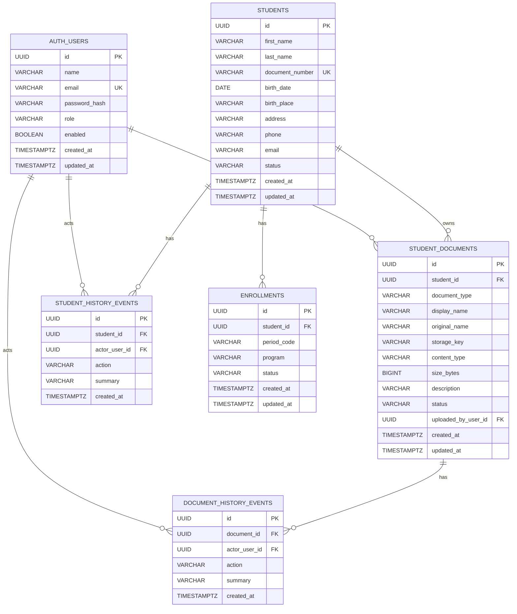

# Arquitectura

El MVP conserva el monorepo con frontend Angular, API Gateway y microservicios Spring Boot solo donde son utiles para el alcance actual.

- `api-gateway`: entrada publica, CORS, validacion JWT y proxy hacia servicios internos.
- `auth-service`: autenticacion, usuarios de desarrollo, BCrypt, JWT, Flyway y PostgreSQL.
- `student-service`: gestion de estudiantes, hojas de vida, documentos, almacenamiento local desacoplado, auditoria, Flyway y PostgreSQL.
- `frontend/fmud-web`: Angular standalone, lazy loading, Reactive Forms, Signals, guards, interceptores, modo claro/oscuro y UI responsive.

## Hexagonal en student-service

- Dominio: `domain/model`, `domain/document`, `domain/history`.
- Aplicacion: comandos, DTOs, puertos de entrada/salida y casos de uso.
- Adaptadores web: controladores REST/multipart.
- Adaptadores de salida: JPA/PostgreSQL y almacenamiento local.
- Infraestructura: seguridad JWT, configuracion, excepciones.

Los controladores no contienen reglas de negocio y no se exponen entidades JPA.

## Datos y archivos

PostgreSQL usa una sola base `fmud` con schemas `auth` y `students`, gestionada con Flyway y `ddl-auto=validate`. Los archivos no se guardan como Base64: se almacenan en volumen Docker con claves fisicas unicas y se descargan mediante endpoint autorizado.

## Modelo entidad-relacion final

## Seguridad

Los roles activos son `ADMIN` y `SECRETARIO`. Las restricciones se aplican en frontend para experiencia de usuario y en backend para control real.
